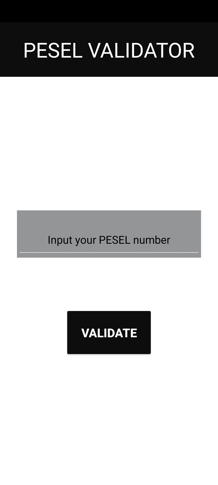
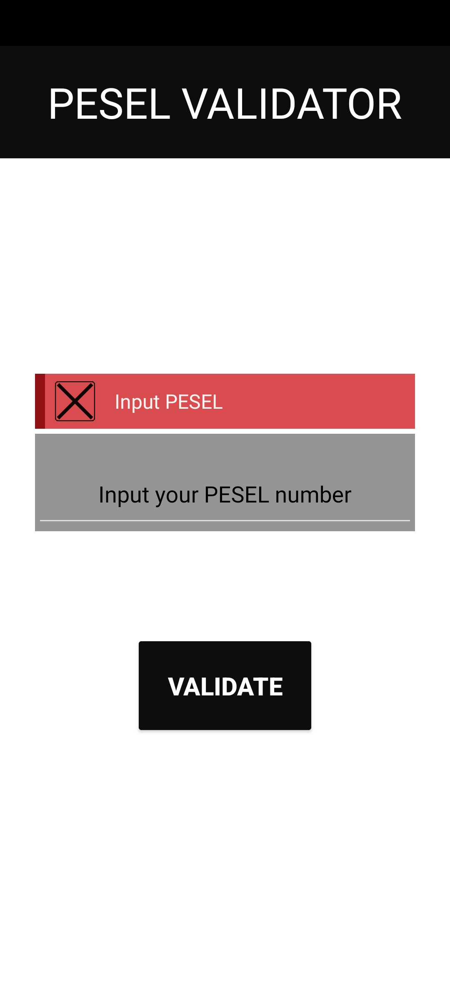
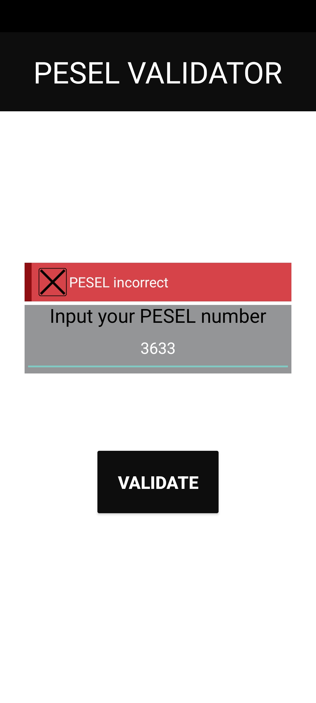
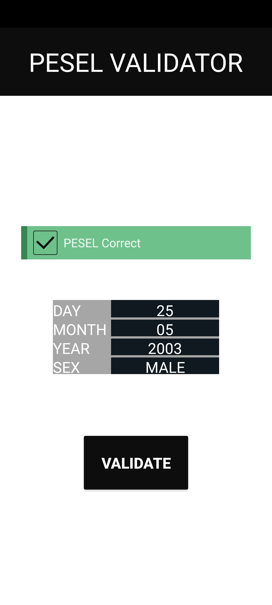

# PESEL validator app
App to validate the PESEL of the user.
## PESEL validation
The PESEL is validated with the directions provided by the Polish government.
## Usage
Enter the PESEL to validate into the input box.
### Initial view

### Clicking the "Validate" button with an empty string

### Inputing an incorrect PESEL

### Inputing a correct PESEL

# License
[MIT](LICENSE.txt)